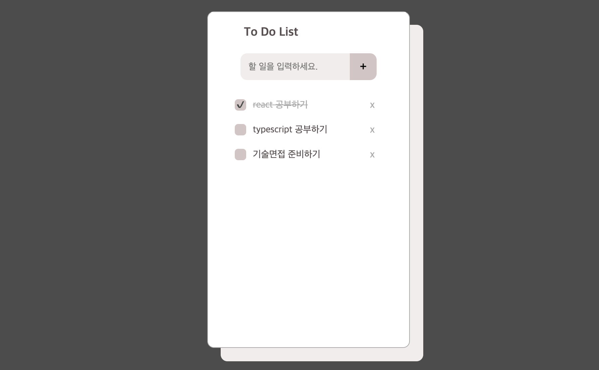

# 📔 To Do List

순수 자바스크립트만 사용하여 개발한 To Do List 입니다.

## 👩🏻‍💻 개발자 소개

<table>
  <tbody>
    <tr>
      <td align="center"><a href="https://github.com/ziiYOU/"> <b> 방지영 </b></a> </td>
    </tr>
  </tbody>
</table>

## ⚙️ 기술 스택

## 📌 주요 기능

**1. To Do List 등록**  
**2. 완료한 List 체크 및 해제**  
**3. To Do List 삭제**  
**4. To Do List를 LocalStorage에 저장** : 새로고침하더라도 데이터 유지 가능.
